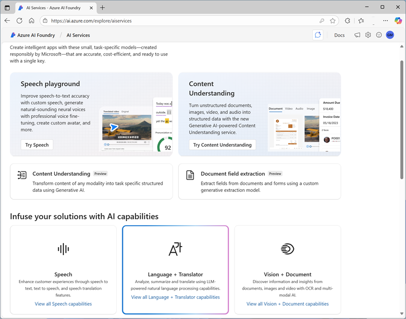
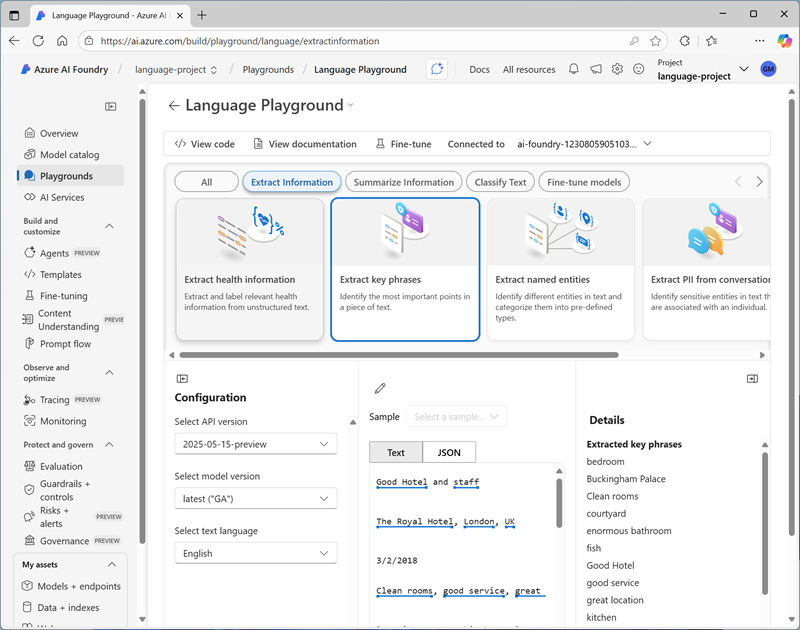
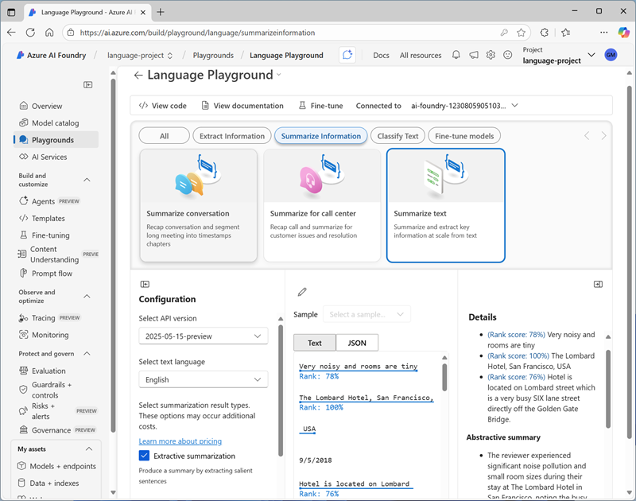
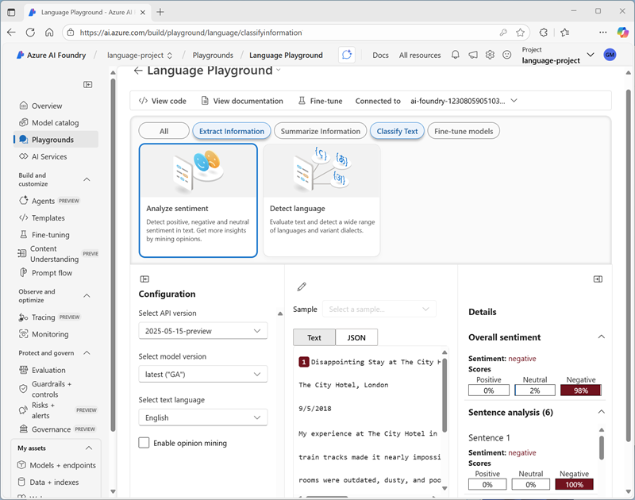

---
lab:
    title: 'Analyze text in Azure AI Foundry portal'
---

# Analyze text in Azure AI Foundry portal

Azure AI Language includes Text Analytics, with capabilities such as entity recognition, key phrase extraction, summarization, and sentiment analysis. For example, suppose the fictitious travel agent Margie's Travel encourages customers to submit reviews for hotel stays. You could use the Language service to extract named entities, identify key phrases, summarize text, and more.

In this exercise, you will use Azure AI Language in Azure AI Foundry portal, Microsoft's platform for creating intelligent applications, to analyze hotel reviews. 

This exercise takes approximately **20** minutes.

## Create a project in Azure AI Foundry portal

1. In a web browser, open the [Azure AI Foundry portal](https://ai.azure.com) at `https://ai.azure.com` and sign in using your Azure credentials. Close any tips or quick start panes that are opened the first time you sign in, and if necessary use the **Azure AI Foundry** logo at the top left to navigate to the home page, which looks similar to the following image (close the **Help** pane if it's open):

    

1. Scroll to the bottom of the page, and select the **Explore Azure AI Services** tile.

    

1. On the Azure AI Services page, select the **Language + Translator** tile.

    

1. On the **Language + Translator** page, select **Try the Language playground**. Then, when prompted, create a new project with the following settings:
    - **Project name**: *Enter a valid name for your project.*
    - **Advanced settings**:
        - **Subscription**: *Your Azure subscription*
        - **Resource group**: *Create or select a resource group*
        - **Region**: *Select any **AI Foundry recommended** region*
        - **AI Foundry or Azure OpenAI** *Create a new Azure AI Foundry resource with a valid name*

1. Select **Create**. Wait for your project to be created. It may take a few minutes.

1. When the project is created, you will be taken to an **Language** playground (if not, in the task pane on the left, select **Playgrounds** and open the Language playground from there.)

    The Language playground is a user interface that enables you to try out some Azure AI Language capabilities.  

## Use Azure AI Language to analyze text

Azure AI Language offers a wide range of text analysis capabilities.

### Extract named entities with Azure AI Language in Azure AI Foundry portal

*Named entities* are words that describe people, places, and objects with proper names. Let's use the named entity extraction capability of Azure AI Language to identify types of information in a review.

1. In the Language playground, select **Extract information**. Then select the **Extract named entities** tile. 

1. Under *Sample*, enter the following review:

    ```
    Tired hotel with poor service
    The Royal Hotel, London, United Kingdom
    5/6/2018
    This is an old hotel (has been around since 1950's) and the room furnishings are average - becoming a bit old now and require changing. The internet didn't work and had to come to one of their office rooms to check in for my flight home. The website says it's close to the British Museum, but it's too far to walk.
    ```

1. Select **Run**. Review the output.

    

    Notice in the *Details* section how the extracted entities come with additional information such as type and confidence scores. The confidence score represents the likelihood that the type identified actually belongs to that category.

### Extract key phrases with Azure AI Language in Azure AI Foundry portal

*Key phrases* are the most important pieces of information in text. Let's use the key phrase extraction capability of Azure AI Language to pull important information from a review.

1. In the Language playground, select **Extract information**. Then select the **Extract key phrases** tile. 

1. Under *Sample*, enter the following review:

    ```
    Good Hotel and staff
    The Royal Hotel, London, UK
    3/2/2018
    Clean rooms, good service, great location near Buckingham Palace and Westminster Abbey, and so on. We thoroughly enjoyed our stay. The courtyard is very peaceful and we went to a restaurant which is part of the same group and is Indian ( West coast so plenty of fish) with a Michelin Star. We had the taster menu which was fabulous. The rooms were very well appointed with a kitchen, lounge, bedroom and enormous bathroom. Thoroughly recommended.
    ```

1. Select **Run**. Review the output.

    

    Notice the different phrases extracted in the *Details* section. These phrases should contribute most to the text's meaning.

### Summarize text with Azure AI Language in Azure AI Foundry portal
 
Let's look at Azure AI Language's summarization capabilities.

1. In the Language playground, select **Summarize information**, then select the **Summarize text** tile.

1. Under *Sample*, enter the following review:
    
    ```
    Very noisy and rooms are tiny
    The Lombard Hotel, San Francisco, USA
    9/5/2018
    Hotel is located on Lombard street which is a very busy SIX lane street directly off the Golden Gate Bridge. Traffic from early morning until late at night especially on weekends. Noise would not be so bad if rooms were better insulated but they are not. Had to put cotton balls in my ears to be able to sleep--was too tired to enjoy the city the next day. Rooms are TINY. I picked the room because it had two queen size beds--but the room barely had space to fit them. With family of four in the room it was tight. With all that said, rooms are clean and they've made an effort to update them. The hotel is in Marina district with lots of good places to eat, within walking distance to Presidio. May be good hotel for young stay-up-late adults on a budget
    ```

1. Select **Run**. Review the output.

    

    Notice the *Extractive summary* in *Details* provides rank scores for the most salient sentences.

### Analyze sentiment in text

Sentiment analysis is a common task when analyzing text like hotel reviews.

1. In the Language playground, select **Classify text**. Then select the **Analyze sentiment** tile.

1. Under *Sample*, enter the following review:
    
    ```
    Disappointing Stay at The City Hotel
    The City Hotel, London
    9/5/2018
    My experience at The City Hotel in London was far from pleasant. The constant noise from nearby train tracks made it nearly impossible to sleep, with vibrations felt throughout the building. The rooms were outdated, dusty, and poorly maintained—dripping faucets, squeaky beds, and broken fixtures were just the beginning. Sound insulation was nonexistent, so every conversation from neighboring rooms was clearly audible. While the location near public transport was convenient and the staff were friendly, these positives couldn't make up for the overall discomfort and lack of value. I wouldn’t recommend this hotel to anyone seeking a restful or enjoyable stay.
    ```

1. Select **Run**. Review the output.

    

    Notice that the analysis produces an overall sentiment score and individual scores for each sentence.

## Detect language and translate text

Azure AI Language enables you to detect the language in which text is written. Additionally, Azure AI Translator enables you to easily translate text from one language to another.

### Detect language

Let's start by detecting the language a review is written in.

1. In the **Classify Text** pane, select the **Detect language** tile.

1. Under *Sample*, enter the following review:
    
    ```
    Un séjour mémorable à l’Hôtel d’Ville
    l’Hôtel d’Ville, Paris
    9/5/2018
    J’ai passé un excellent séjour à l’Hôtel d’Ville à Paris. L’emplacement est idéal, en plein cœur de la ville, ce qui permet de découvrir facilement les principaux sites touristiques. Le personnel était chaleureux, professionnel et toujours prêt à aider. La chambre était propre, confortable et bien équipée, avec une vue charmante sur les rues parisiennes. Le petit-déjeuner était varié et délicieux, parfait pour commencer la journée. Je recommande vivement cet hôtel à tous ceux qui recherchent une expérience parisienne authentique et agréable.
    ```

1. Select **Run**. Review the output.

    

    Notice that the language is detected as French. 

### Translate text

Now let's translate the French review to English.

1. At the top of the page, use the **&larr;** (back) link next to the **Language playground** page title to view all available playgrounds.
1. In the list of playgrounds, open the **Translator playground**.
1. In the Translator playground, select **Text translation**.
1. In the **Configure** pane, select the following language options:
    - **Translate from**: French
    - **Translate to**: English
1. Under *Sample*, enter the French-language review:
    
    ```
    Un séjour mémorable à l’Hôtel d’Ville
    l’Hôtel d’Ville, Paris
    9/5/2018
    J’ai passé un excellent séjour à l’Hôtel d’Ville à Paris. L’emplacement est idéal, en plein cœur de la ville, ce qui permet de découvrir facilement les principaux sites touristiques. Le personnel était chaleureux, professionnel et toujours prêt à aider. La chambre était propre, confortable et bien équipée, avec une vue charmante sur les rues parisiennes. Le petit-déjeuner était varié et délicieux, parfait pour commencer la journée. Je recommande vivement cet hôtel à tous ceux qui recherchent une expérience parisienne authentique et agréable.
    ```

1. Select **Translate**. Review the output.

    

    Notice that the French review is translated to English.

## Clean up

If you don’t intend to do more exercises, delete any resources that you no longer need. This avoids accruing any unnecessary costs.

1. Open the **Azure portal** at [https://portal.azure.com](https://portal.azure.com) and select the resource group that contains the resources you created.
1. Select **Delete resource group** and then **enter the resource group name** to confirm. The resource group is then deleted.

## Learn more

To learn more about what you can do with this service, see the [Language service page](https://learn.microsoft.com/azure/ai-services/language-service/overview).
