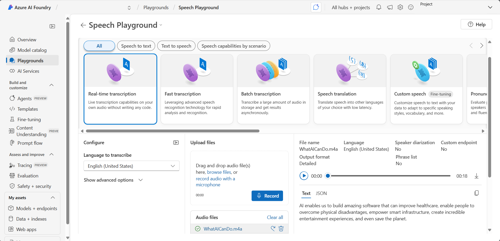

---
lab:
    title: 'Explore speech in Azure AI Foundry portal'
---

# Explore speech in Azure AI Foundry portal

The **Azure AI Speech** service transcribes speech into text, and text into audible speech. You might use AI Speech to create an application that can transcribe meeting notes or generate text from the recording of interviews.

In this exercise, you will use Azure AI Speech in Azure AI Foundry portal, Microsoft's platform for creating intelligent applications, to transcribe audio using the built-in try-it-out experiences. 

This exercise takes approximately **15** minutes.

## Create a project in Azure AI Foundry portal

1. In a web browser, open the [Azure AI Foundry portal](https://ai.azure.com) at `https://ai.azure.com` and sign in using your Azure credentials. Close any tips or quick start panes that are opened the first time you sign in. 

1. In the browser, navigate to `https://ai.azure.com/managementCenter/allResources` and select **Create new**. Then choose the option to create an **Azure AI Foundry resource**.

1. In the *Create a project* wizard, enter a valid name for your project.

1. Expand *Advanced options* to specify the following settings for your project:
    - **Subscription**: Your Azure subscription
    - **Resource group**: Create or select a resource group
    - **Region**: Select one of the following locations:
        * East US
        * France Central
        * Korea Central
        * West Europe
        * West US

    Select **Create**. Wait for your project to be created. It may take a few minutes.

1. When the project is created, you will be taken to an *Overview* page of the project details.
 
1. On the left-hand menu on the screen, select **Playgrounds**.

    >*Note*: You may need to expand the menu to make your selection.

1. In Azure AI Foundry's Playgrounds page, select **Try the Speech playground**. The Speech playground is a user interface that enables you to try out some Azure AI Speech capabilities.

## Explore speech to text in Azure AI Foundry's Speech Playground

Let's try out *speech to text* in Azure AI Foundry's Speech Playground. 

1. On the *Speech* page, scroll down and select **Real-time transcription**.

1. Download **speech.zip** by opening the URL `https://aka.ms/mslearn-speech-files` in a new browser tab. Using the URL should automatically download a folder on your computer. 

1. Navigate to the *Downloads* folder on your computer, then identify the downloaded folder. Right-click on the downloaded folder. Select *Extract All...*. Then select *Extract* to unzip its contents. The unzipped folder will appear on the screen. Close the unzipped folder. Notice that the unzipped folder is now also in your *Downloads* folder.    

1. In the Azure AI Foundry Speech portal, under *Upload files*, select **Browse files**. Navigate unzipped folder. Select **WhatAICanDo.m4a** and then **Open**.

    

1. The Speech service transcribes and displays the text in real time. If you have audio on your computer, you can listen to the recording as the text is being transcribed.

1. Review the output. 

    >*Note*: To see the full output, you may need to minimize the *Configure* pane. To minimize, select the icon to the right of the *Configure* heading.

1. In the output, under *Text*, you can see the audio transcibed into text. 

In this exercise you tried out Azure AI Speech services in Azure AI Foundry's Speech Playground. You then used Real-time transcription to transcribe an audio recording. You were able to see the text transcription being generated as the audio file was played.

## Clean up

If you don't intend to do more exercises, delete any resources that you no longer need. This avoids accruing any unnecessary costs.

1. Open the [Azure portal]( https://portal.azure.com) and select the resource group that contains the resource you created.
1. Select the resource and select **Delete** and then **Yes** to confirm. The resource is then deleted.

## Learn more

This exercise demonstrated one of the many capabilities of the Speech service. To learn more about what you can do with this service, see the [Speech page](https://azure.microsoft.com/services/cognitive-services/speech-services).
