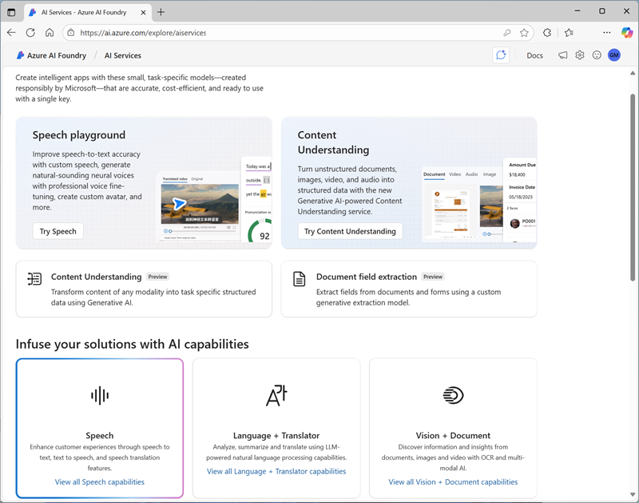
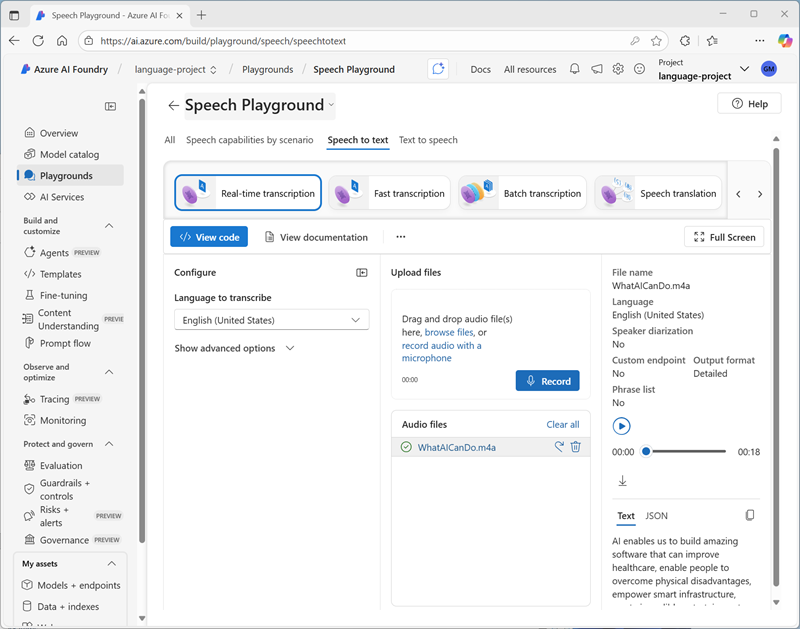
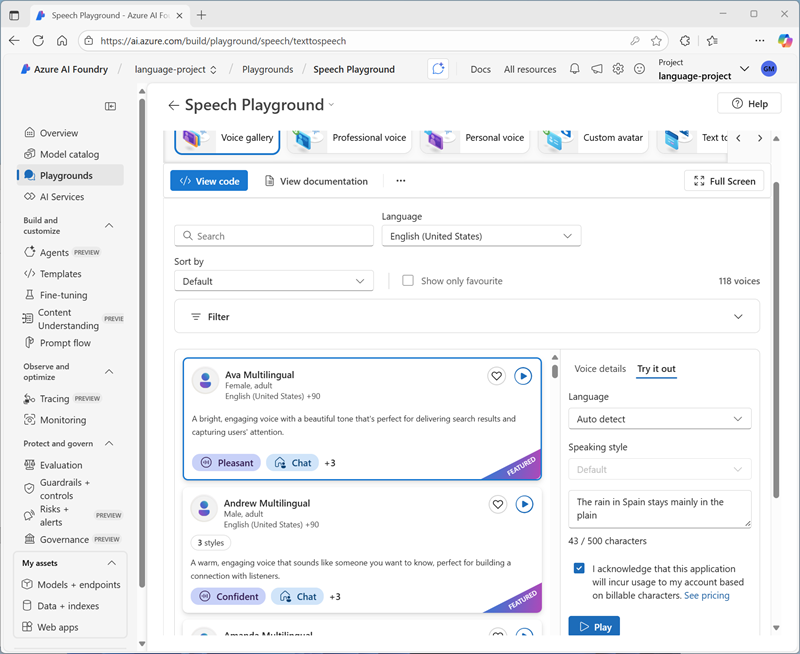

---
lab:
    title: 'Explore speech in Azure AI Foundry portal'
---

# Explore speech in Azure AI Foundry portal

Azure AI Speech transcribes speech into text, and turns text into audible speech. You might use AI Speech to create an application that can transcribe meeting notes or generate text from the recording of interviews, or to support an interactive AI assistant that can respond to spoken commands and queries.

In this exercise, you will use Azure AI Speech in Azure AI Foundry portal, Microsoft's platform for creating intelligent applications, to explore core Azure AI Speech capabilities. 

This exercise takes approximately **15** minutes.

## Create a project in Azure AI Foundry portal

1. In a web browser, open the [Azure AI Foundry portal](https://ai.azure.com) at `https://ai.azure.com` and sign in using your Azure credentials. Close any tips or quick start panes that are opened the first time you sign in, and if necessary use the **Azure AI Foundry** logo at the top left to navigate to the home page, which looks similar to the following image (close the **Help** pane if it's open):

    

1. Scroll to the bottom of the page, and select the **Explore Azure AI Services** tile.

    

1. On the Azure AI Services page, select the **Speech** tile.

    

1. On the **Speech** page, select **Go to Speech playground**. Then, when prompted, create a new project with the following settings:
    - **Project name**: *Enter a valid name for your project.*
    - **Advanced settings**:
        - **Subscription**: *Your Azure subscription*
        - **Resource group**: *Create or select a resource group*
        - **Region**: *Select any **AI Foundry recommended** region*
        - **AI Foundry or Azure OpenAI** *Create a new Azure AI Foundry resource with a valid name*

1. Select **Create**. Wait for your project to be created. It may take a few minutes.

1. When the project is created, you will be taken to an **Speech** playground (if not, in the task pane on the left, select **Playgrounds** and open the Speech playground from there.)

    The Speech playground is a user interface that enables you to try out some Azure AI Speech capabilities.  

## Explore speech to text in Azure AI Foundry's Speech Playground

Let's try out *speech to text* in Azure AI Foundry's Speech Playground.

1. In a new browser tab, download **[speech.zip](https://aka.ms/mslearn-speech-files)** from `https://aka.ms/mslearn-speech-files` in a new browser tab. After downloading the file, extract it to a local folder. 

1. Back in the Azure AI Foundry portal, on the Speech page, on the **Speech to text** tab, select **Real-time transcription**.

1. Under **Upload files**, select **Browse files** and upload **WhatAICanDo.m4a** from the folder to downloaded and extracted.

    The Speech service transcribes and displays the text in real time. If you have audio on your computer, you can listen to the recording as the text is being transcribed.

    

1. Review the output. 

    >*Tip*: To see the full output, you may need to minimize the *Configure* pane. To minimize, select the icon to the right of the *Configure* heading.

    In the output, under **Text**, you can see the audio transcibed into text.

## Explore text to speech in Azure AI Foundry's Speech Playground

Now let's see how Azure AI Speech can generate audible speech from text.

1. In the Speech playground, select the **Text to speech** tab and ensure **Voice gallery** is selected.
1. View the available voices, and select one (such as *Ava Multilingual*).
1. In the **Voice details** pane, select the **Try it out** tab. Then enter some text (for example, `The rain in Spain stays mainly in the plain`) and use the **Play** button to synthesize speech from the text.

    

    The text is spoken using the selected voice. You can try other voices to compare the spoken output.

## Clean up

If you don't intend to do more exercises, delete any resources that you no longer need. This avoids accruing any unnecessary costs.

1. Open the [Azure portal]( https://portal.azure.com) and select the resource group that contains the resource you created.
1. Select the resource and select **Delete** and then **Yes** to confirm. The resource is then deleted.

## Learn more

This exercise demonstrated one of the many capabilities of the Speech service. To learn more about what you can do with this service, see the [Speech page](https://azure.microsoft.com/services/cognitive-services/speech-services).
