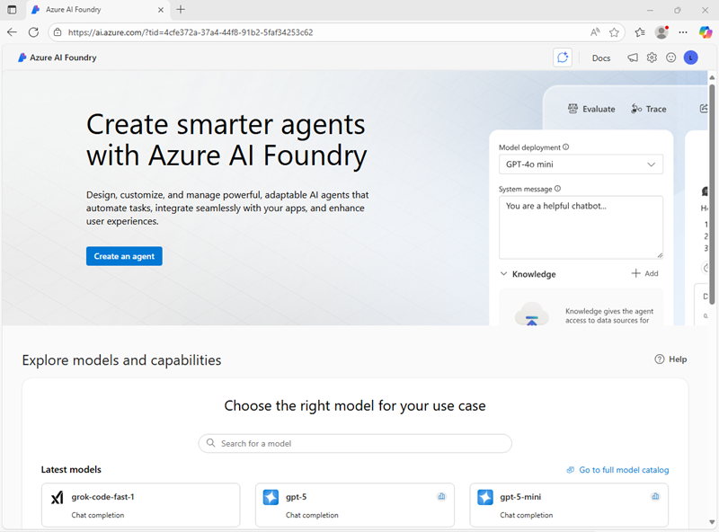
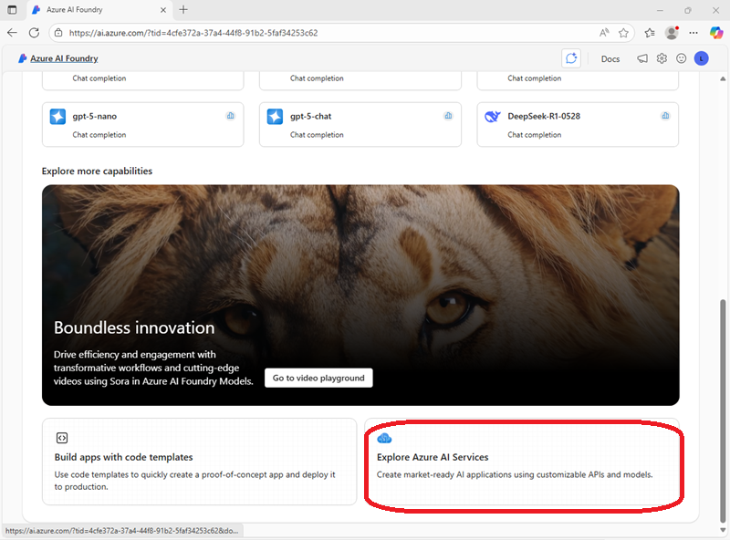
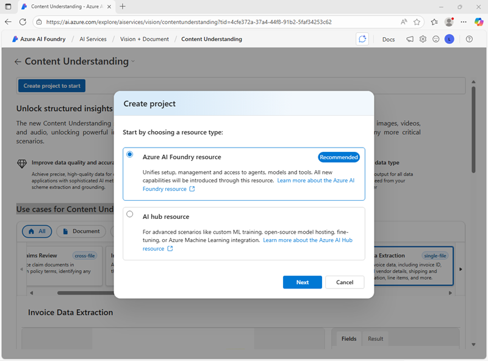
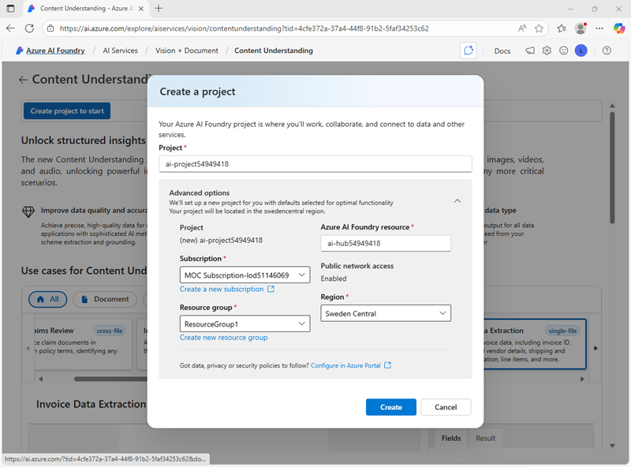
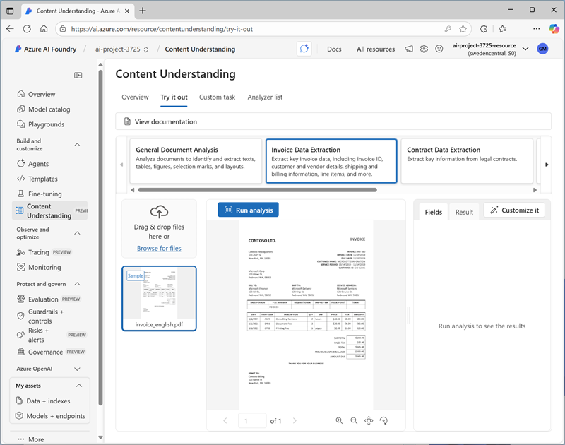
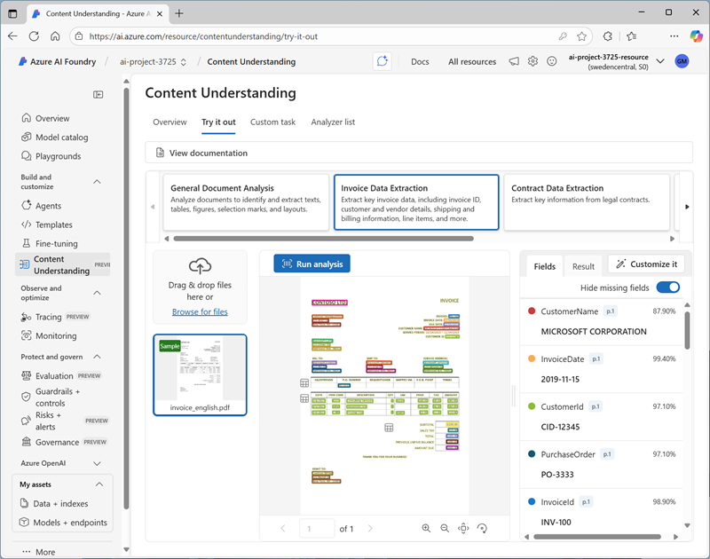
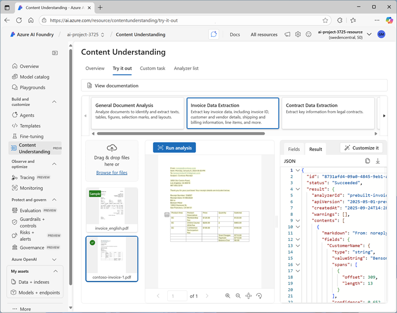

---
lab:
    title: 'Extract data with Content Understanding in Azure AI Foundry portal​'
---

# Extract data with Content Understanding in Azure AI Foundry portal

Azure AI Content Understanding provides multi-modal analysis of documents, audio files, video, and images to extract information.

In this exercise, you will use Azure AI Content Understanding in Azure AI Foundry portal, Microsoft's platform for creating intelligent applications, to extract information from invoices. 

This exercise takes approximately **25** minutes.

## Create an Azure AI Foundry project for content understanding

1. In a web browser, open the [Azure AI Foundry portal](https://ai.azure.com) at `https://ai.azure.com` and sign in using your Azure credentials. Close any tips or quick start panes that are opened the first time you sign in, and if necessary use the **Azure AI Foundry** logo at the top left to navigate to the home page, which looks similar to the following image (close the **Help** pane if it's open):

    

1. Scroll to the bottom of the page, and select the **Explore Azure AI Services** tile.

    

1. On the Azure AI Services page, select **Try Content Understanding**.

    

1. In the Content Understanding page, select **Create a project to start**. Then in the **Create project** dialog, select the recommended resource type (**Azure AI Foundry resource**):

    

1. On the **Next** page, enter a valid name for your project. Then Select **Advanced options** and specify the following settings:
    - **Azure AI Foundry resource**: *A valid name for your Azure AI Foundry resource*
    - **Subscription**: *Your Azure subscription*
    - **Resource group**: *Create or select a resource group*
    - **Region**: Select one of the following locations\*:
        * West US
        * Sweden Central
        * Australia East

    \**At the time of writing, Content Understanding is supported in these regions.*

    

1. Select **Create**. Wait for the set up process to complete. It may take a few minutes.

## Extract information from an invoice

1. Download [contoso-invoice-1.pdf](https://raw.githubusercontent.com/MicrosoftLearning/mslearn-ai-fundamentals/refs/heads/main/data/contoso-invoice-1.pdf) from `https://raw.githubusercontent.com/MicrosoftLearning/mslearn-ai-fundamentals/refs/heads/main/data/contoso-invoice-1.pdf`. 

1. On the Content Understanding page, select the **Try it out** tab, and then select the **Invoice Data Extraction** tile.

    

    A sample invoice is provided.

1. Select the sample invoice and use the **Run analysis** button to extract information from it. When analysis is complete, view the results.

    

1. Use the **Browse for files** link to upload the **contoso-invoice-1.pdf** document you downloaded previously, and run analysis on that file.

    

    Note that the Content Understanding analyzer is able to extract information from this invoice, even though it is formatted diffferently from the sample.

1. In the pane pn the right where the extracted fields are displayed, view the **Result** tab to see the JSON response that would be sent to a client application. A developer would write code to process this response and do something with the extracted fields.

    

## Clean up

If you’ve finished working with the Content Understanding service, you should delete the resources you have created in this exercise to avoid incurring unnecessary Azure costs.

- In the Azure portal, delete the resource group you created in this exercise.
